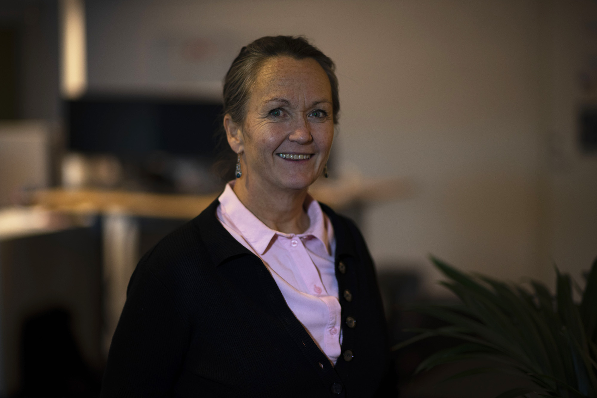

<h2 class="a-h3"> Ta kontroll over egne tjenester </h2>

Med Altinn 3 kan du selv definere datamodell. Det vil si at du kan definere hvilke data som trengs i saksbehandling, samt hvilke format du ønsker å motta dataene i. Du kan lage relevante brukergrensesnitt og se hvordan disse vises i nettleser, og selvfølgelig også hvordan de kommuniserer med andre systemer.

Du setter opp den relevante tjenesteflyten for din tjeneste, og definerer hvilke steg brukeren skal gjennom i tjenesten. Underveis kan du teste løsningen, og med Altinn 3 skal du være rustet til å produksjonssette tjenesten på egenhånd. Du får tilgang til alle data som hentes inn. Og, skulle du trenge støtte er vi der for deg! ([altinnstudio.slack.com](https://altinnstudio.slack.com/))

<h2 class="a-h3"> De beste tjenestene til brukerne </h2>

Få tilgang til en multikanal-løsning som tilrettelegger både for nettleser og systemer hos virksomheter. Slipp utfylling av eksisterende data med et system som er tilrettelagt for gjenbruk, og kom et skritt nærmere Once Only-prinsippet.

Når vi lager sammenhengende tjenester som faktisk virker, slipper brukeren å bli sendt mellom ulike tjenester. Målet er at brukeren ikke skal vite at det er flere tjenester som er koblet sammen for å dekke behovene. De møter et gjenkjennbart design på tvers av etater hvor de kan ha tillit til at data lagres på et trygt og forsvarlig vis. I Altinn 3 ligger det til rette for å lage tjenester i responsivt design, og det dekker selvfølgelig alle krav til teknisk universell utforming.

Det er mange ulike behov, og vi vet at det ikke er mulig å tvinge alle inn i standarder. Derfor har vi lagt stor vekt på fleksibilitet. Og med fleksibilitet følger ulikt behov for ytelse. Dette tilpasser vi for, slik at dine brukere slipper å sitte og vente på at tjenesten skal fungere.

  <h2 class="a-fontBold a-blueDarkerText">Hva kan du gjøre nå, og hvordan blir det på sikt?</h2>
  
Vi jobber smidig når vi utvikler Altinn 3. Det betyr at vi utvikler det som gir størst verdi først, lærer og justerer oss underveis og tilpasser oss brukernes behov.

  <ul class="no-decoration connected-bullets connected-bullets-headings">
    <li class="false">
      <h2 class="a-fontBold a-blueDarkerText">
        2021 — Dette jobber vi med i løpet av våren 
      </h2>
      

        

          <h3 class="a-h4">Stadig mer fleksible og tilgjengelige tjenester</h3>
          
Vi har allerede flere funksjoner på plass, men vil utvide med støtte for blant annet instanser som ikke legges i brukerens arkiv. Standardopplevelsen i Altinn har vært at når du har sendt inn noe, ligger det en kopi av det i arkivet ditt. Nå blir det mulig å gjøre unntak fra dette slik at enkelte innsendinger ikke legges i arkivet til brukeren, for eksempel av sikkerhetsårsaker. Vi vil også utvide med nye valideringer hvor brukeren får advarsel men ikke blir hindret i innsending.

          <h3 class="a-h4">Mulighetene i innboks utvides</h3>
          
I Altinn 3 blir meldinger tett knyttet til de innsendingene de er relevant for. De er faktisk del av samme applikasjon. Du får også mulighet til å lage kopier, og det blir en forbedring av statusvisninger i innboksen. Da forstår brukerne bedre hvor de er i prosessen, hvem de venter på og hva som gjenstår.

          <h3 class="a-h4">I samspill med omverdenen</h3>
          
Vi tilgjengeliggjør eFormidling som mulig grensesnitt for push av data til tjenesteeier. I tillegg kommer  push av hendelser. Dette gjør det enklere for systemer både hos brukerne og hos tjenesteeier å vite når det har skjedd noe med tjenestene.

          <a href="https://altinnstudio.slack.com/">Har du andre behov? Snakk med oss på slack</a>
          <h3 class="a-h4 pt-1">Enklere og mer effektivt for utviklere</h3>
          
For utviklerne er Altinn 3 og Altinn studio betydelig enklere og mer effektivt å jobbe med enn tidligere. Der møter utviklerne kjent, moderne teknologi med innebygd onboarding. Og selvfølgelig baserer vi oss på lagring i skyen!

        

        

          

            

              
            

            

              
Alle som bor og jobber i Norge skal få fordelene digitaliseringen kan gi. Med fremtidens plattform for sammenhengende digitale tjenester på trappen, og ved å sette brukeren i sentrum, skal vi få til én digital offentlig sektor.

              
Cathrine Holten, Avdelingsdirektør Digitaliseringsdirektoratet

            

          

          

            

              
95%

            

            

              
95% av alle i Norge kjenner til Altinn og 59% ønsker å finne dine tjenester der. 

              Fra Altinns innbyggerundersøkelse
            

          

        

      

    </li>
    <li class="false">
      <h2 class="a-fontBold a-blueDarkerText">
        2021 - 2023 — Dette planlegger vi fremover
      </h2>
      

        

          <h3 class="a-h4">Forbedring av Altinn studio</h3>
          
For å gjøre det enda enklere for utviklerne, lager vi støtte for å bruke egne elementer og komponenter i Altinn studio. Vi tilrettelegger også for «pick and mix», slik at du enkelt kan låne og gjenbruke fra andre tjenester. I tillegg kommer det en ny og forbedret versjon av dashboardet der du har oversikt over tjenestene dine.

          <h3 class="a-h4">Sammenhengende tjenester – enda flere muligheter</h3>
          
Har du savnet muligheten for utvidet fritekstsøk i innboks? Nå kommer det! I tillegg til å søke på tema og overskrifter utvider vi søket til å også gjelde innhold i tjenestene og meldingene. Vi tilrettelegger også for å sette flere tjenester sammen i kjeder ved at de reagere på hendelser – både i og utenfor Altinn.

          <h3 class="a-h4">Autentisering og autorisasjon</h3>
          
Her planlegger vi støtte for delegering på app-nivå og på instansnivå. Det vil være samme fleksibilitet i delegering som du er kjent med fra Altinn II. 

          
Vil du kikke oss nærmere i kortene? <a href="https://github.com/Altinn/altinn-studio/issues">Backlogen vår er åpen på Github</a>.

          <h3 class="a-h4">Forbedret infrastruktur </h3>
          
I dag har infrastrukturen fungerende backup og restore for sluttbrukertjenestedata. Men hvorfor stoppe der? Vi skal blant annet sørge for backup av alle data i Altinn studio og virusscanning av brukernes vedlegg. Og alle dere som er tjenesteeiere vil få tilgang på data for monitorering og analyse.

        

        

        

      

    </li>
    <li class="false">
      <h2 class="a-fontBold a-blueDarkerText">
        2024 — Hva skal Altinn 3 bli til slutt?
      </h2>
      

        

          Vel, vi tenker plattformen til Altinn aldri skal bli ferdig. Med dette mener vi at vi fortsetter å basere oss på brukerbehov og innsikt, og at vi lærer, utvikler og tilpasser oss etter hvert. Behov vil endre seg – og det vil vi også. Sammen med deg som tjenesteeier skal vi sørge for at Altinn 3 blir – og fortsetter å være – det beste verktøyet for å utvikle sammenhengende digitale tjenester!
        

        

        

      

    </li>

